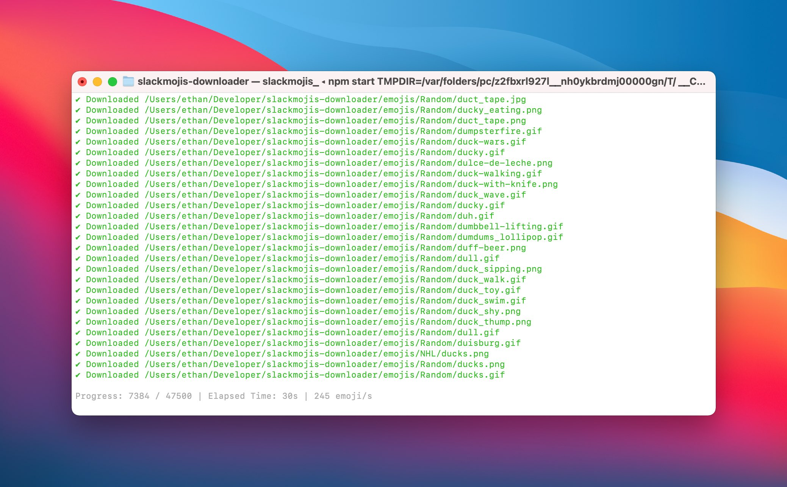

# slackmojis-dl

Downloads all emojis from https://slackmojis.com/



## Prerequisites
```
- Node v10 or greater
- NPM
```

## Usage
```
npx slackmojis-dl
```

### Options
```
  --dest      Output directory. Defaults to the working directory
  --category  Specify a category to download
  --limit     Restrict the number of pages to download
  --dump      Save the emoji listing to ./emojis.json
              Override save location with --path
```

### Examples
```
  $ npx slackmojis-dl --dest desired/path
  $ npx slackmojis-dl --limit=5
  $ npx slackmojis-dl --dest desired/path --dump
  $ npx slackmojis-dl --category "Hangouts Blob"
```

### Note

Emojis already found within the `emojis/` directory won't be downloaded again on subsequent runs. For a fresh download, delete the `emojis/` directory.

## Organization

```
emojis
|
|-- Cat Emojis
|    |
|    |-- angry_cat.png
|    |-- anguished_cat.png
|    ...
|
|-- Facebook Reaction
|    |
|    |-- fb-angry.gif
|    |-- fb-heart.gif
|    ...
|
|  ...
```

## Further Usage

These can then be uploaded to Slack manually or with an extension such as [Neutral Face Emoji Tools](https://chrome.google.com/webstore/detail/neutral-face-emoji-tools/anchoacphlfbdomdlomnbbfhcmcdmjej?hl=en) to drag-and-drop an entire folder.
